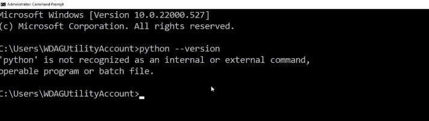

# Task3 User Manual (Palindrome Checker)


## Introduction

The Palindrome Checker is a simple Python program made to determine whether a given word or phrase is a palindrome. 

### What's a palindrome?

A palindrome is a word or phrase that reads the same backward as forward (ignoring spaces and capitalisation). Examples include "madam", "racecar", and "ka yak"

This program processes the input, removes spaces, converts all characters to lowercase and checks if the string matches its reverse.

## Features

- Checks if a word or phrase is a palindrome

- Ignores spaces and capitalisation

- Provides a simple True or False output

## What you will need

1. Python 3.x installed on your computer

2. A basic text editor or an integrated development environment (IDE) to view and run the code e.g vs code

## How to Set Up

### 1. Installing Python

First install python, but before you do this use the following command to check if you already have python installed:

```bash 
python --version
```

Hint: Your terminal can be found by typing cmd in the searchbox (windows) or Click the Launchpad icon in the Dock, type Terminal (MacOS)



If the above is displayed then navigate to python.org and install python!


### 2. Save the file

Save the script with a .py extension (e.g., maths_quiz.py)

### 3. Run the Program

1. Your chosen IDE e.g vs code

2. Open the file downloaded from the IDE

3. Run the script using a button to run the code - alternatively you can run the following command in your terminal:

```bash 
python maths_quiz.py
```

4. You’re ready to run the code!


## python palindrome_checker.py How to Use

1. Launch the program by running the script

2. Replace `"ka yak"` in the code with the word or phrase you want to check For example:
```python
print(check_palindrome("Racecar"))
```

3. Run the script again. The program will output True if the input is a palindrome and False if not


## Example Usage


Input:
```python
print(check_palindrome("Racecar"))
```

Output:
```python
True
```

Input:
```python
print(check_palindrome("boat"))
```

Output
```python
False
```

## Technical Details

### Code Overview

- Case Insensitivity: The program converts all input to lowercase using word.lower()

- Whitespace Removal: Spaces are removed using word.replace(" ", "")

- Palindrome Check: The reversed string (word[::-1]) is compared with the original

- Boolean Output: If the reversed string matches the original, the function returns True; otherwise, it returns False

## Extra Notes